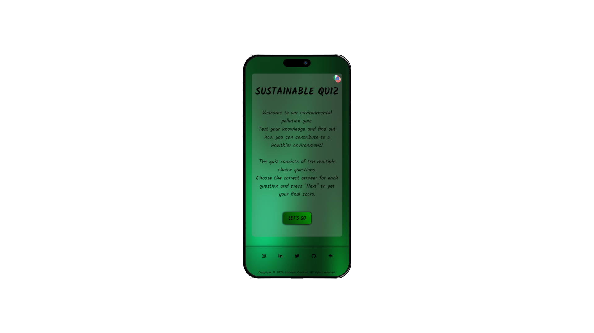

 

  <h2 align="center">Sustainable Quiz</h2>

  

     
    <a href="https://github.com/gabrielecruciani/sustainableQuiz">Explore the docs »</a>
     
     
    <a href="https://sustainablequiz.netlify.app">View Demo</a>
  

<!-- ABOUT THE PROJECT -->
## About The Project

  

 

This website is a project realized for Start2Impact University.

The task was to create a web app react quiz to raise people's awareness of the environment.

To meet the project's request and have an engaging, fun and competitive quiz, I implemented a points system that allows you to quantify knowledge regarding the topic.

In order to broaden the audience and not limit the quiz to just one language, I created a button that allows you to easily and quickly switch from Italian to English and vice versa.

## Installation

1. Clone the repository.
2. Navigate to the project directory.
3. Install dependencies using `npm install`.

## Built With

The application had to be developed with TypeScript, React, Html and Css.
 

  
  
  
  
  

<!-- LICENSE -->
## License

Distributed under the GENERAL PUBLIC LICENSE. See `LICENSE` for more information.
 

<!-- CONTACT -->
## Socials

  
  
  
  
  

